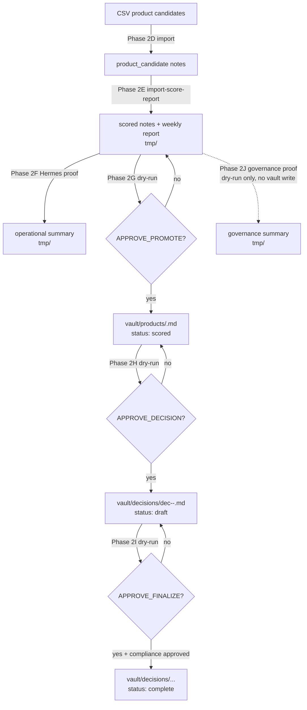
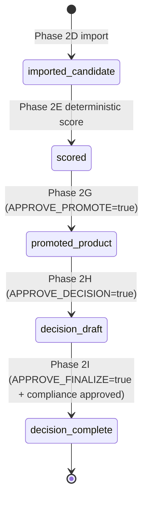

# Phase 2 Governance Flow

Governance model for the Affiliate Product Intelligence OS Phase 2 pipeline:
how a product candidate moves from import to a finalized, human-approved decision,
and where the approval gates and memory boundaries sit.

---

## 1. End-to-end governance flow



---

## 2. State transition diagram



States:

- **imported candidate** — `product_candidate` note from CSV (no scores yet).
- **scored** — deterministic Product Opportunity Score + `score_decision` attached.
- **promoted product** — written to `vault/products/`, `status: scored` (Phase 2G).
- **decision draft** — `vault/decisions/...`, `status: draft` (Phase 2H).
- **decision complete** — same note, `status: complete`, with `finalized_at` and
  `finalization_reason` (Phase 2I).

---

## 3. Approval gates

Each gate defaults to dry-run and requires explicit opt-in:

| Gate | Phase | Trigger | Effect |
|------|-------|---------|--------|
| **Approve promote** | 2G | `APPROVE_PROMOTE=true` | write `vault/products/<id>.md` |
| **Approve decision creation** | 2H | `APPROVE_DECISION=true` | write `vault/decisions/dec-<id>-<week>.md` (draft) |
| **Approve finalization** | 2I | `APPROVE_FINALIZE=true` | mutate draft → `status: complete` |

Gate rules:

- Gates are **independent and non-sticky** — approving one does not approve the next.
- No gate overwrites: an existing destination causes a hard failure.
- Finalization additionally requires `compliance_status: approved` on the decision.

---

## 4. Why Phase 2J is dry-run only

Phase 2J is a **governance orchestration proof**, not an executor. Its job is to
demonstrate that Hermes can drive and summarize the chain **without bypassing any
approval gate**. If Phase 2J could approve writes, it would defeat the purpose of
the human gates it is meant to prove.

Therefore Phase 2J:

- runs only the tmp-safe stages live (Phase 2E, and Phase 2G in dry-run),
- **statically verifies** that the Phase 2H and Phase 2I scripts + guardrail
  wrappers exist,
- never sets any `APPROVE_*` flag, and never writes `vault/`.

---

## 5. Why `decision_status` and `finalization_status` are `not_executed` in Phase 2J

Phase 2H reads from `vault/products/<id>.md` and Phase 2I reads from
`vault/decisions/<id>.md`. Those inputs exist only after **approved** writes by
Phase 2G and Phase 2H respectively.

Because Phase 2J performs **no vault writes**, those inputs do not exist during a
governance proof, so Phase 2H and Phase 2I cannot run. The governance summary
reports this honestly:

```
decision_status: not_executed
finalization_status: not_executed
compliance_gate_status: not_evaluated
```

This is the **correct** outcome, not a failure: it proves the gates hold and that
the chain halts before any vault write absent explicit human approval.

---

## 6. Business-memory boundaries

| Layer | Path | Meaning | Committed to GitHub? |
|-------|------|---------|----------------------|
| Runtime | `tmp/` | transient outputs, safe to delete | no (gitignored) |
| Product memory | `vault/products/` | promoted, scored products | no (gitignored) |
| Decision memory | `vault/decisions/` | decision drafts + finalized decisions | no (gitignored) |

Principles:

- **`tmp/` is runtime** — reproducible, disposable, never authoritative.
- **`vault/products/` is product memory** — the durable record of what was promoted.
- **`vault/decisions/` is decision memory** — the durable record of what was decided.
- Private business memory never leaves the local Obsidian vault; GitHub is the
  engineering control plane only.

---

## 7. Security model

- **Default-deny writes:** every vault write requires an explicit per-phase approval.
- **No network:** no external APIs; `ENABLE_OPENAI_API_DIRECT=true` hard-fails.
- **No publish:** `ENABLE_AUTOPUBLISH=true` hard-fails; no campaign launch path exists.
- **Path-traversal guard:** `product_id` / `decision_id` must match strict regexes
  (`^[a-z0-9-]+$` and `^dec-[a-z0-9-]+-\d{4}-W\d{2}$`).
- **Content sanitization:** override/finalization reasons are scrubbed for affiliate
  tracking patterns and secret patterns; promotion rejects notes carrying secrets or
  affiliate URLs.
- **No overwrite:** existing destinations fail closed.
- **Sanitized summaries:** orchestration summaries are scrubbed of private vault
  paths, affiliate-content markers, and external URLs before being written to `tmp/`.
- **Private data stays local:** all private vault dirs are gitignored.

---

## 8. Future phases

Phase 2 is intentionally headless and human-gated. Planned evolution:

- **Phase 3A — CLI dashboard summary:** read-only terminal summary of vault state
  (products, decisions, statuses). No writes.
- **Phase 3B — local read-only UI:** local viewer for products/decisions. Read-only.
- **Phase 3C — UI approval panels:** surface the existing approval gates in a UI;
  approvals remain explicit human actions (no automation of approval).
- **Phase 4 — marketplace connectors:** read-only / manual-approved connectors for
  live marketplace data. No autopublish, no campaign launch.

Each future phase must preserve the Phase 2 guardrails: no autopublish, no campaign
launch, no default vault writes, and human-explicit approval for every write.
