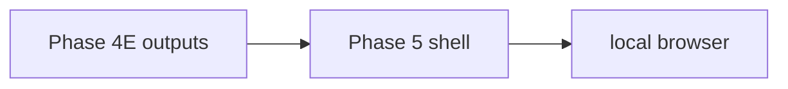

# Phase 5 Read-only UI Shell Plan

## 1. Phase 5 objective

Provide a local, read-only way to view the product intelligence demo output that
the CLI already generates, without adding a backend, an API, a database, a
frontend framework, or any state mutation. Phase 5 layers a local view over the
approved static projections produced in Phase 4; it never reads or writes the
vault.

Phase 5A (this plan) is documentation and contract-tests only. No UI shell is
implemented yet.

## 2. Proposed subphases

- **Phase 5A: boundary plan** — define boundary, data contract, allowed and
  forbidden functions, and security guardrails (this phase, docs/tests only).
- **Phase 5B: local static shell prototype** — a local, static read-only shell
  over Phase 4 outputs.
- **Phase 5C: shell verifier / acceptance** — a verifier and acceptance pack for
  the shell prototype.
- **Phase 5D: operator command for shell demo** — a single operator command that
  builds and points at the static shell demo.
- **Phase 5E: release snapshot update** — fold the shell into the release
  snapshot.

## 3. Recommended Phase 5B scope

- A static, local shell.
- No framework if at all possible.
- If a framework is proposed later, it must be justified in a separate phase.
- Read Phase 4 JSON outputs first as the source of truth.
- No vault read or write.
- No backend.
- No external URLs.

## 4. Data flow

Text form: Phase 4E outputs -> Phase 5 shell -> local browser.

The shell reads the scrubbed Phase 4 projections (preferred: the Phase 4B
snapshot manifest, the Phase 4C catalog, the Phase 4D verification summary, and
the Phase 4E demo bundle summary) and renders a local view only.

## 5. Non-goals

- production UI
- user auth
- API server
- database
- approval workflows
- external connectors
- marketplace ingestion
- affiliate content generation
- autopublish
- campaign launch

## 6. Risk register

- **Scope creep into a web app** — keep Phase 5B static and local; any framework
  needs a separate justified phase.
- **Accidental vault/path leakage** — never read the vault; scan output and fail
  closed if a vault path appears.
- **Raw artifact reuse** — consume only scrubbed Phase 4 projections; never emit
  raw artifact bodies, `input_path`, or `note_refs`.
- **Stale snapshots** — the view is a static snapshot; document that it must be
  rebuilt after artifacts change.
- **Adding a backend too early** — a backend is a separate future phase, not
  part of 5B.
- **Adding a framework too early** — a framework is a separate justified phase,
  not part of 5B.

## 7. Acceptance checklist for future Phase 5B

- Reads Phase 4 outputs as the source of truth.
- Performs no vault reads and no vault writes.
- Performs no approval mutation (no approvals, promote, create decision, or
  finalize decision).
- Uses no backend, no server, no API routes, no FastAPI, and no database.
- Uses no external APIs and no external URLs.
- Adds no marketplace connector and ingests no marketplace data.
- Generates no affiliate content, performs no autopublish, and launches no
  campaign.
- HTML-escapes all dynamic fields and links only to local static files with
  relative links.
- Ships with a guardrail test that fails closed on boundary violations.

## 8. Exit criteria for Phase 5A

- The four Phase 5A files exist.
- `docs/UI_SHELL_BOUNDARY.md` and this plan document the boundary, data
  contract, forbidden functions, forbidden implementation choices, and security
  guardrails.
- The docs state that Phase 5A is docs/tests only and that no UI shell exists
  yet.
- `tests/test_phase5a_ui_shell_boundary_plan.py` passes and the full suite stays
  green.
- No `.gitignore` change, no runtime script, and no frontend/backend files were
  added.
- Final status target: `phase5a_status: success`.
